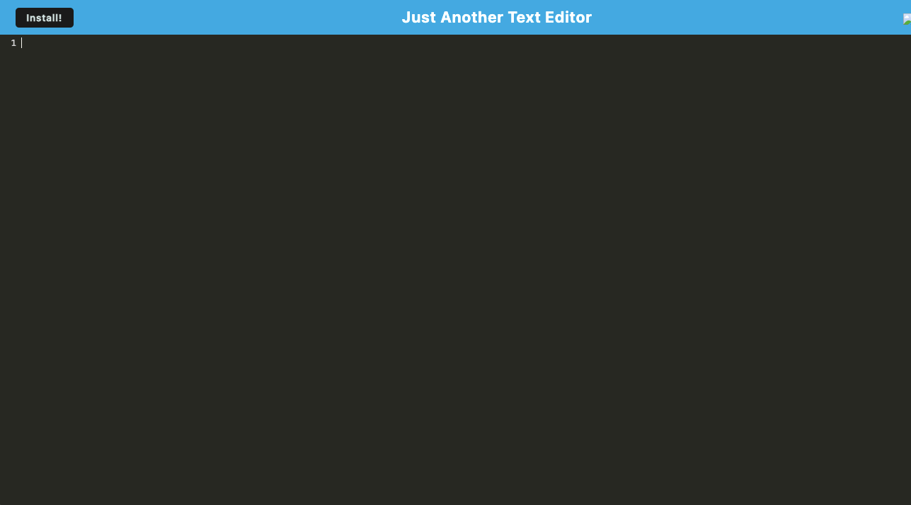

# Text Editor 
This text editor web application allows the user to create notes or code snippets with or without an internet connection, so that they can reliably retrieve them for later use.
The application features a client-server folder structure and uses webpack to bundle JavaScript files. Running npm run start from the root directory starts both the backend and serves the client. The application supports next-gen JavaScript and generates a service worker, HTML file, and manifest via webpack plugins. IndexedDB is used for saving and retrieving content entered in the editor, even after closing and reopening the app. It includes an installable PWA feature and ensures assets are pre-cached using a registered service worker. Build scripts are provided for deployment on Render.
